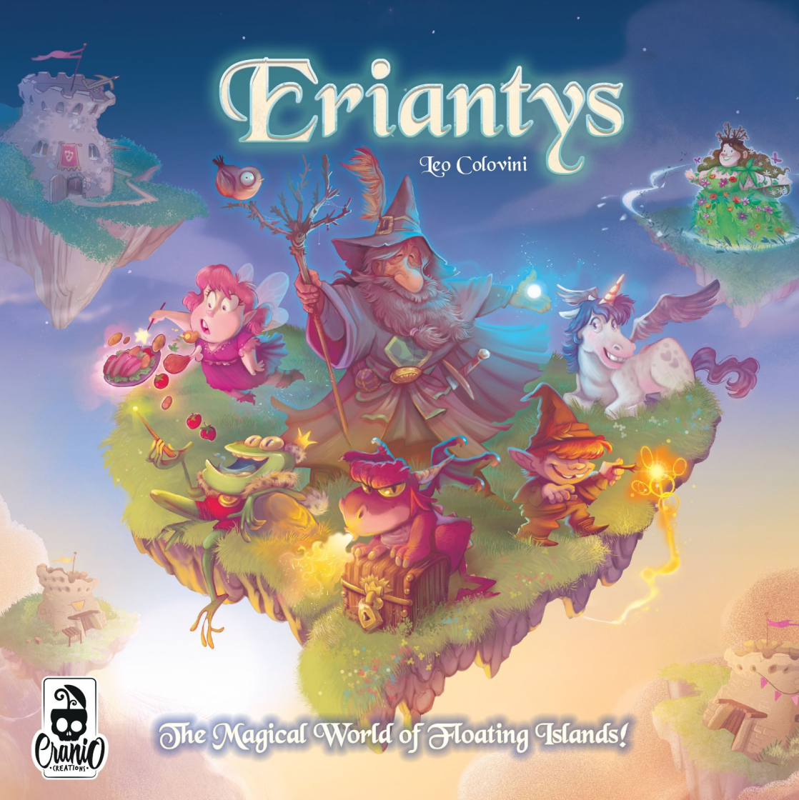

# Final Examination of Software Engineering - AY 2021-2022
*Read this in other languages: [english](https://github.com/FerriAlessandro/ing-sw-2022-Ferri-Gabbini-Gaillet/blob/main/README.md), [italiano](https://github.com/FerriAlessandro/ing-sw-2022-Ferri-Gabbini-Gaillet/blob/main/README.it.md)*

This project is intended to satisfy the requirements of the Final Examination of Software Engineering (prof. San Pietro) for the BSc in Engineering of Computing Systems at Politecnico di Milano.


Implementation of the [Eryantis](https://www.craniocreations.it/prodotto/eriantys/) board game as an online multiplayer game.

This project consists in the implementation of the game mentioned above as a single server able to run a single game at once and multiple clients (one for each player) that can play a single game. The MVC (Model-View-Controller) pattern is used as the base structure of the project. The communication between server and client is realized using Java Object serialization and Java.net sockets. The user can interact with the game using one of two interfaces: a Command Line Interface or a Graphical User Interface.

## Documentation

### UML
The Class Diagrams (described using UML) are available here:
- [Initial UML diagrams](https://github.com/FerriAlessandro/ing-sw-2022-Ferri-Gabbini-Gaillet/tree/main/deliverables/uml_diagrams/initial)
- [Final UML diagrams](https://github.com/FerriAlessandro/ing-sw-2022-Ferri-Gabbini-Gaillet/tree/main/deliverables/uml_diagrams/final)

### JavaDoc
The project documentation was written following Java documentation techniques and can be read in html formal using the 'javadoc' command on the source files.

### Test Coverage
Testing efforts focused on the model and was implemented using JUnit. 
The following table shows a summary of coverage report on the mentioned package.

| Package               | Class % | Method % | Line % |
|-----------------------|---------|----------|--------|
| it.polimi.ingsw.model | 90%     | 89%      | 82%    |

### Libraries e Plugins
In this section a brief description of libraries and plugins used in the project is provided.

| Library/Plugin | Description                                                                                    |
|----------------|------------------------------------------------------------------------------------------------|
| __Maven__      | Project-management tool, provides for automation of compilation and managment of dependencies. |
| __JUnit__      | Unit testing framework.                                                                        |
| __JavaFx__     | Library used to create Graphical User Interfaces                                               |


## Functionalities
### Developed functionalities
- Complete ruleset
- CLI
- GUI
- 3 Advanced functionalities:
    - __Persistence:__ the state of the current game is saved on disk. This way the game can be restored and played even if the server execution is interrupter.
    - __Disconnection-resilience__ a player can reconnect after they were disconnected.
    - __All character cards:__ all characters present in the original board-game were implemented.


## Compilation and packaging
### Executables
The executable (.jar) was created using the Maven Shade plugin. This file is available [here](https://github.com/FerriAlessandro/ing-sw-2022-Ferri-Gabbini-Gaillet/tree/main/deliverables/jar).
To compile the jar on your own use the Maven package and compile commands.

## Run the game
This game requires Java 17 or higher.

### Client
In this section the procedure needed to run the Eryantis client is described.

#### CLI
To run the Command Line Interface write the following command in the terminal:
```
java -jar PSP15.jar --cli
```
or
```
java -jar PSP15.jar --c
```
It is also possible to use a simplified version of the CLI. In this version no drawings are shown and the game is described completely using text. This version is runnable using:
```
java -jar PSP15.jar --simple
```
or
```
java -jar PSP15.jar --s
```

To enjoy an optimal experience when playing using the CLI on Windows we suggest using the [Windows Terminal](https://github.com/Microsoft/Terminal).

#### GUI
Tu run the game using the Graphical User Interface two options are available:
- opening the executable file ```PSP15.jar``` as you normally would (double-clicking) 
- running the following command via the command line: ```java -jar PSP15.jar```

### Server
To run the server run the following command using the command line:
```
java -jar PSP15.jar --server [<port_number>]
```
or
```
java -jar PSP15.jar -server [<port_number>]
```
#### Parameters
It is possible to specify the server port (the default value is __2351__).

## Group members
In this section all group (code PSP15) members are listed in alphabetical order.
- [__Alessandro Ferri__](https://github.com/FerriAlessandro)
- [__Alessandro Gabbini__](https://github.com/alessandroGabbini)
- [__Angelo Giovanni Gaillet__](https://github.com/aggaillet)

## License
Eriantys is a board game created and owned by [Cranio Creations](www.craniocreations.it), graphical assets are under their copyright.
The software is licensed under the [MIT License](https://github.com/FerriAlessandro/ing-sw-2022-Ferri-Gabbini-Gaillet/blob/main/LICENSE), you may use it according to its guidelines.
